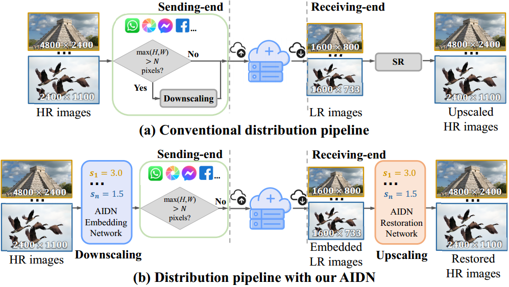

## **Scale-Arbitrary Invertible Image Downscaling (AIDN)**

Official PyTorch implementation for the paper:

> **Scale-Arbitrary Invertible Image Downscaling**
>
> ***IEEE Transactions on Image Processing (TIP) 2023***
>
> Jinbo Xing*, Wenbo Hu*, Menghan Xia, Tien-Tsin Wong    (*joint first authors)
>
> <a href='https://arxiv.org/abs/2201.12576'></a> <a href='https://doubiiu.github.io/projects/aidn/'></a>

<p align="center">

</p>

> We present a scale-arbitrary invertible image downscaling network (AIDN) to natively downscale HR images with arbitrary scale factors. Meanwhile, the HR images could be restored with AIDN whenever necessary.

<p align="center">

</p>

> Usecase of our AIDN. (a) shows the conventional pipeline of distributing HR images over
social media platforms. (b) shows the distribution pipeline with our proposed
AIDN. <i>H</i> and <i>W</i> denote the height and width of images; s<sub>1</sub>, ..., s<sub>n</sub> are scale factors; and <i>N</i> stands for the upper-limit resolution of various social media platforms.

## **TODO**
[] Release an interactive inspection demo.

## **Changelog**
- 2023.07.17 Release code and model weights!

## **Environment**
```
conda env create -f AIDN.yml
```

## **Dataset Preparation**
The training and testing datasets can be downloaded [here](https://github.com/xinntao/BasicSR/blob/master/docs/DatasetPreparation.md). 

For training, download & unzip DIV2K dataset, and put `DIV2K_train_HR/` and `DIV2K_valid_HR/` into `Data/`. Fill the path in `dataset/prepare_div2k.py` and execute this script to split the images into patches.

The processed datasets should be as below:
```
Data/
└── DIV2K/
  ├── DIV2K_valid_HR
  ├── DIV2K_train_HR_patch/
  ├── DIV2K_valid_HR_patch/
    ├── 0801_001.png
    ├── ...
    └── 0900_021.png
  └── list/
    ├── train.txt
    ├── val.txt
    └── test.txt
```

We crop the images in testing datasets to make sure their height and width are divisible by 12. The datasets should be as below: 
```
Data/
├── Set5/
  └──GTmod12/
    ├── xxx.png
    ├── ...
    └── xxx.png
├── Set14/
├── urban100/
├── BSDS100/
├── DIV2K/
└── list/
    ├── DIV2K_val.txt
    ├── ...
    ├── BSDS100_val.txt
    └── DIV2K_val.txt
```
where `*.txt` are data lists, whose rows will be `<dataset_name>/GTmod12/<img_filename>`, e.g. in `BSDS100_val.txt`:
```
BSDS100/GTmod12/101085.png
...
BSDS100/GTmod12/97033.png
```

## **Train**
```
sh scripts/train.sh <exp_name> <config_path>
e.g.: sh scripts/train.sh AIDN_exp01 config/DIV2K/AIDN.yaml
```
Note that, we firstly train the model with a fixed $\times$ 4 scale for 300 epochs and then on all scale factors for 280 epochs in the paper. We find it can achieve slightly better performance, while this training strategy is just optional.

After training, the log and model weights will be saved in `LOG/DIV2K/<exp_name>`.


## **Benchmark**
```
sh scripts/benchmark.sh <exp_name> <config_path>
e.g.: sh scripts/benchmark.sh AIDN_exp01 config/DIV2K/AIDN.yaml
```
To benchmark the pre-trained model weights, please download the weights of [AIDN](https://drive.google.com/file/d/1tYlOTQvnsszfLs6cn8p4GQ3Nkzgb4r92/view?usp=drive_link)  and place it in the `LOG/DIV2K/pre-train/` folder, and then run the benchmarking script:
```
sh scripts/AIDN_benchmark.sh config/DIV2K/AIDN_benchmark.yaml
```
The JPEG-robust version of AIDN (i.e., [AIDN+](https://drive.google.com/file/d/1l0vsFlbiy3KkOM-dExOHmTQTWpJbo1wO/view?usp=drive_link)) and the weights of [AIDN](https://drive.google.com/file/d/1vicEmixQGrIH815MXN2WPKjKrk6qjUVC/view?usp=sharing) pre-trained with fixed $\times$ 4 scale are also available.

## **Citation**
If you find the code useful for your work, please star this repo and consider citing:
```
@article{xing2022scale,
  title={Scale-arbitrary invertible image downscaling},
  author={Xing, Jinbo and Hu, Wenbo and Wong, Tien-Tsin},
  journal={arXiv preprint arXiv:2201.12576},
  year={2022}
}
```

## **Acknowledgement**
The code is partially borrowed from [EDSR](https://github.com/sanghyun-son/EDSR-PyTorch), [ArbSR](https://github.com/The-Learning-And-Vision-Atelier-LAVA/ArbSR) and [DiffJPEG](https://github.com/mlomnitz/DiffJPEG). We thank the authors for sharing their code.

## **Related Work**
- [Invertible Image Rescaling (ECCV 2020 & IJCV 2022)](https://github.com/pkuxmq/Invertible-Image-Rescaling)
- [Real-time 6K Image Rescaling with Rate-distortion Optimization (CVPR 2023)](https://github.com/AbnerVictor/HyperThumbnail)
- [Towards Bidirectional Arbitrary Image Rescaling: Joint Optimization and Cycle Idempotence (CVPR 2022)](https://arxiv.org/abs/2203.00911)